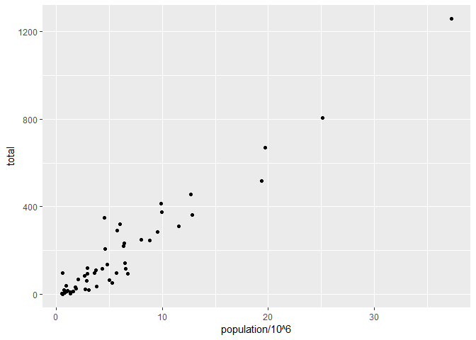
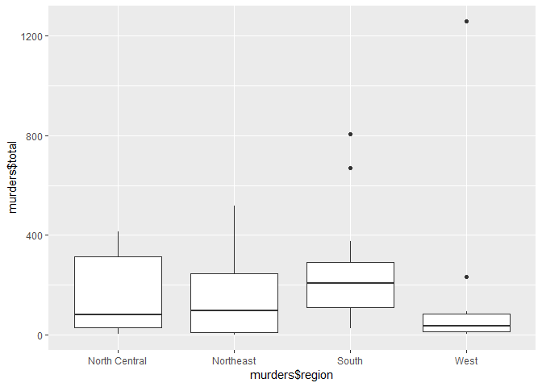
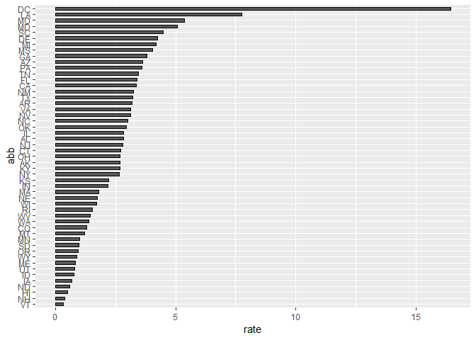
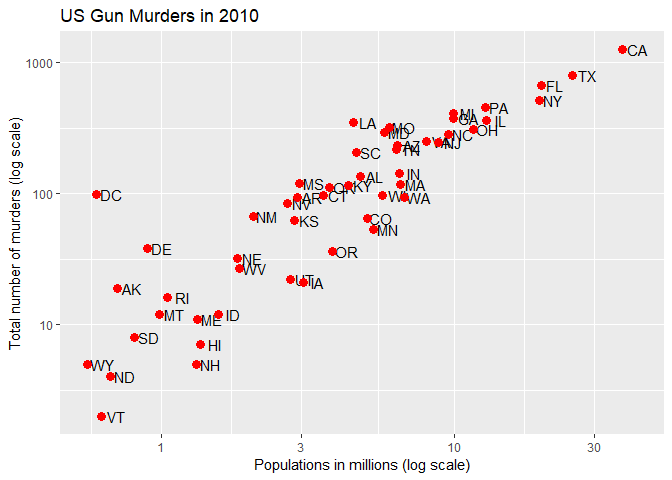

Murders
================

Introduction
------------

This is a report on 2010 gun murder rates obtained from FBI reports. The original data was obtained from [this Wikipedia page](https://en.wikipedia.org/wiki/Murder_in_the_United_States_by_state).

We are going to use the following library:

``` r
library(tidyverse)
```

    ## Warning: package 'tidyverse' was built under R version 3.5.2

and load the data we already wrangled:

``` r
load("rdas/murders.rda")
```

Least populated states
----------------------

``` r
murders %>% arrange(population) %>% head()
```

    ## # A tibble: 6 x 6
    ##   state                abb   region        population total   rate
    ##   <chr>                <chr> <fct>              <dbl> <dbl>  <dbl>
    ## 1 Wyoming              WY    West              563626     5  0.887
    ## 2 District of Columbia DC    South             601723    99 16.5  
    ## 3 Vermont              VT    Northeast         625741     2  0.320
    ## 4 North Dakota         ND    North Central     672591     4  0.595
    ## 5 Alaska               AK    West              710231    19  2.68 
    ## 6 South Dakota         SD    North Central     814180     8  0.983

6 Most populated states
-----------------------

``` r
murders %>% arrange(desc(population)) %>% head()
```

    ## # A tibble: 6 x 6
    ##   state        abb   region        population total  rate
    ##   <chr>        <chr> <fct>              <dbl> <dbl> <dbl>
    ## 1 California   CA    West            37253956  1257  3.37
    ## 2 Texas        TX    South           25145561   805  3.20
    ## 3 Florida      FL    South           19687653   669  3.40
    ## 4 New York     NY    Northeast       19378102   517  2.67
    ## 5 Illinois     IL    North Central   12830632   364  2.84
    ## 6 Pennsylvania PA    Northeast       12702379   457  3.60

Total murder reported and state population plot
-----------------------------------------------

``` r
murders %>% ggplot() + geom_point(aes(x = population/10^6, y = total))
```



6 states with lowest murder rates
---------------------------------

``` r
murders %>% arrange(rate) %>% head()
```

    ## # A tibble: 6 x 6
    ##   state         abb   region        population total  rate
    ##   <chr>         <chr> <fct>              <dbl> <dbl> <dbl>
    ## 1 Vermont       VT    Northeast         625741     2 0.320
    ## 2 New Hampshire NH    Northeast        1316470     5 0.380
    ## 3 Hawaii        HI    West             1360301     7 0.515
    ## 4 North Dakota  ND    North Central     672591     4 0.595
    ## 5 Iowa          IA    North Central    3046355    21 0.689
    ## 6 Idaho         ID    West             1567582    12 0.766

6 states with highest population
--------------------------------

``` r
murders %>% arrange(desc(rate)) %>% head()
```

    ## # A tibble: 6 x 6
    ##   state                abb   region        population total  rate
    ##   <chr>                <chr> <fct>              <dbl> <dbl> <dbl>
    ## 1 District of Columbia DC    South             601723    99 16.5 
    ## 2 Louisiana            LA    South            4533372   351  7.74
    ## 3 Missouri             MO    North Central    5988927   321  5.36
    ## 4 Maryland             MD    South            5773552   293  5.07
    ## 5 South Carolina       SC    South            4625364   207  4.48
    ## 6 Delaware             DE    South             897934    38  4.23

10 states with least murder rate
--------------------------------

``` r
murders %>% top_n(10, rate)
```

    ## # A tibble: 10 x 6
    ##    state                abb   region        population total  rate
    ##    <chr>                <chr> <fct>              <dbl> <dbl> <dbl>
    ##  1 Arizona              AZ    West             6392017   232  3.63
    ##  2 Delaware             DE    South             897934    38  4.23
    ##  3 District of Columbia DC    South             601723    99 16.5 
    ##  4 Georgia              GA    South            9920000   376  3.79
    ##  5 Louisiana            LA    South            4533372   351  7.74
    ##  6 Maryland             MD    South            5773552   293  5.07
    ##  7 Michigan             MI    North Central    9883640   413  4.18
    ##  8 Mississippi          MS    South            2967297   120  4.04
    ##  9 Missouri             MO    North Central    5988927   321  5.36
    ## 10 South Carolina       SC    South            4625364   207  4.48

Higest murder rates
-------------------

``` r
murders %>% arrange(desc(rate)) %>% top_n(10)
```

    ## Selecting by rate

    ## # A tibble: 10 x 6
    ##    state                abb   region        population total  rate
    ##    <chr>                <chr> <fct>              <dbl> <dbl> <dbl>
    ##  1 District of Columbia DC    South             601723    99 16.5 
    ##  2 Louisiana            LA    South            4533372   351  7.74
    ##  3 Missouri             MO    North Central    5988927   321  5.36
    ##  4 Maryland             MD    South            5773552   293  5.07
    ##  5 South Carolina       SC    South            4625364   207  4.48
    ##  6 Delaware             DE    South             897934    38  4.23
    ##  7 Michigan             MI    North Central    9883640   413  4.18
    ##  8 Mississippi          MS    South            2967297   120  4.04
    ##  9 Georgia              GA    South            9920000   376  3.79
    ## 10 Arizona              AZ    West             6392017   232  3.63

Murder rate across region
-------------------------

``` r
qplot(murders$region, murders$total, geom = "boxplot")
```



Murder rate across states
-------------------------

``` r
murders %>% mutate(abb = reorder(abb, rate)) %>%   ggplot(aes(abb, rate)) +  
  geom_bar(width = 0.5, stat = "identity", color = "black") +   coord_flip()
```



US Gun murder 2010 in log scale
-------------------------------

``` r
murders %>% ggplot(aes(population/10^6, total, label = abb)) +      
  geom_text(nudge_x = 0.05) +    scale_x_log10() +   scale_y_log10() +   
  xlab("Populations in millions (log scale)") +    ylab("Total number of murders (log scale)") +   
  ggtitle("US Gun Murders in 2010") + geom_point(size = 3, color ="red")
```


